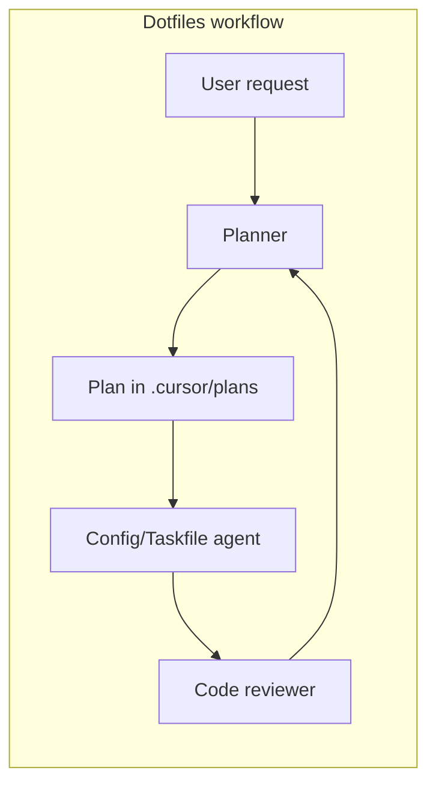

<!-- 3e679162-1fe7-413d-bd8d-a994aee26aa9 -->
# Dotfiles Agentic Workflow Adaptation Plan

## 1. Current state

### 1.1 Dotfiles repository structure

- **Root:** `Taskfile.yml`, `README.md`, `CHANGELOG.md`, `AGENTS.md` (placeholder), `.gitignore`
- **Config areas:** `etc/` (profile, rc, config), `nvim/`, `wezterm/`, `hammerspoon/`, `yazi/`, `tmux/`
- **Automation:** `tasks/` (Taskfiles under `macos/install/*`), `scripts/` (e.g. `hooks/pre-commit`)
- **No** `.cursor/` directory today.

### 1.2 Reference agentic workflow - what we reuse

Reusable **structure and patterns** (not the domain):

| Artifact | Purpose | Reuse in dotfiles |
|----------|---------|-------------------|
| `.cursor/plugin.json` | Manifest for commands/skills/agents discovery | Yes - same layout, dotfiles description |
| `.cursor/agents.json` | Workflow schema: agents, skills, workflows | Yes - reduced agents and one workflow |
| `.cursor/agents/*.md` | Personas and hand-off formats | Yes - rewritten for dotfiles (no Go/K8s) |
| `.cursor/rules/superpowers-*.mdc` | Default workflow (plan → execute → review) | Yes - simplified (no TDD/Gherkin) |
| `.cursor/commands/*.md` | Kickoff and step prompts | Yes - dotfiles-oriented prompts |
| `.cursor/AGENTIC_WORKFLOW.md` | Single doc of flow and agents | Yes - dotfiles flow only |
| `.cursor/WORKFLOW_TRIGGERS.md` | How to invoke and examples | Yes - dotfiles examples |
| `.cursor/GATE_SYSTEM.md` | Gates between agents | Yes - simplified gates |
| `.cursor/plans/README.md` | Plan naming and location | Yes - same naming `YYYY-MM-DD_username_slug.plan.md` |
| `.cursor/skills/*.sh` | Scripts agents can run | Yes - dotfiles-relevant only (no Go) |
| `.cursor-plugin/plugin.json` | Root manifest for Cursor discovery | Yes - same paths under repo |

**Explicitly not reused (reference-repo-specific):**

- Agents: k8s, gateway, infra (Docker/KCP), gherkin-writer, step-definer, tester, reviewer, utils-builder
- Workflows: infrastructure-foundation, crd-foundation, gateway-layer
- Skills: go-fmt, go-vet, golangci-lint, go-build-check, go-test-check, run-godog, validate-gherkin, check-infrastructure (postgres/kine/kcp)
- All references to BuscaMinho, KCP, Gherkin, Godog, CRDs, area plans

---

## 2. Target dotfiles workflow (high level)

- **Single workflow:** "dotfiles change" - plan → implement (config/taskfile) → review → done.
- **No** TDD/Gherkin/E2E; no multi-phase "infrastructure / CRD / gateway" pipelines.
- **Gates:** Planner validates before work; Code reviewer before commit.

---

## 3. Agents to define (minimal set)

| Agent | Role in dotfiles |
|-------|-------------------|
| **planner** | Orchestrator: understand request, write bite-sized plan in `.cursor/plans/`, delegate to config or taskfile agent, validate against plan |
| **config** (or **dotfiles**) | Implements config changes: `etc/`, `nvim/`, `wezterm/`, `hammerspoon/`, `yazi/`, `tmux/`; knows symlink/install flow and READMEs |
| **taskfile** | Creates/updates Taskfiles under `tasks/` and root `Taskfile.yml`; follows existing vars (e.g. DOTFILES_HOME) and includes |
| **code-reviewer** | Reviews config (shell, Lua, YAML, etc.) and scripts; no Go/K8s; can reference pre-commit and style |

**Not included:** infra, k8s, gateway, gherkin-writer, step-definer, tester, reviewer, utils-builder (unless you later add a minimal "script helper" agent).

---

## 4. Skills (scripts) to add

- **taskfile-validate** (or use `task --list`): ensure Taskfile syntax and listing work.
- **pre-commit-run**: run `scripts/hooks/pre-commit` or `task precommit` so reviewer can enforce pre-commit.
- **check-gate-compliance** (optional): simplified version that only checks "plan exists" and "review requested" for dotfiles (no Go/K8s paths).

Drop Go/infra-specific skills (go-fmt, go-vet, golangci-lint, run-godog, validate-gherkin, check-infrastructure).

---

## 5. Rules (superpowers) to adapt

- **superpowers-core.mdc** - Dotfiles version: "If unclear → clarify/brainstorm; plan (bite-sized, exact paths in `etc/`, `nvim/`, etc.); execute one agent per task; after each task → spec compliance then @code-reviewer; at branch end → verify (e.g. task list / pre-commit) and finish-branch options." No TDD/Gherkin; reference only dotfiles paths and `AGENTS.md` / `.cursor/`.
- **superpowers-plan.mdc** - Keep bite-sized tasks and plan naming; change examples from Go paths to dotfiles paths (e.g. `etc/profile/aliases`, `nvim/lua/plugins/...`, `tasks/macos/install/...`).
- **superpowers-git.mdc** - Keep as-is (verify, merge/PR/keep/discard).
- **Optional:** superpowers-brainstorm.mdc (lightweight), superpowers-debug.mdc (for "something broke in my config").
- **Remove or don't add:** superpowers-tdd, superpowers-subagents (or keep subagents minimal: "one agent per task" only).

---

## 6. Commands and docs

- **commands/kickoff.md** - "@planner: Task: [e.g. Add wezterm keybinding for X]. Follow dotfiles workflow: plan with bite-sized tasks → implement (config/taskfile) → @code-reviewer. At completion: run task precommit and finish-branch options."
- **AGENTIC_WORKFLOW.md** - One page: default flow (plan → config/taskfile → review), agent list (planner, config, taskfile, code-reviewer), gate rules (plan validation, code review), plan location (`.cursor/plans/`), skill list.
- **WORKFLOW_TRIGGERS.md** - How to start (e.g. @planner + kickoff text), one "dotfiles change" example, how to invoke @code-reviewer and @taskfile.
- **GATE_SYSTEM.md** - Short: Planner validation before work; Code reviewer before commit; optional Taskfile → "script helper" if you add that later.

---

## 7. agents.json and plugin manifests

- **agents.json:**
  - `agents`: planner, config (or dotfiles), taskfile, code-reviewer.
  - `skills`: taskfile-validate, pre-commit-run (and optionally check-gate-compliance).
  - `workflows`: single entry, e.g. `dotfiles-change`: steps = create plan (planner) → implement (config or taskfile) → review (code-reviewer).
- **.cursor/plugin.json** and **.cursor-plugin/plugin.json**: commands, skills, agents paths; name/description for "Dotfiles" / "Agentic workflow for dotfiles".

---

## 8. Plan naming and plans/README

- Keep plan naming: `YYYY-MM-DD_<username>_<slug>.plan.md` under `.cursor/plans/`.
- **plans/README.md**: state that dotfiles plans live here; optional one-line table: "dotfiles-change workflow: plan → config/taskfile → review".

---

## 9. AGENTS.md in repo root

- Point to `.cursor/` and the agentic workflow: "For AI-assisted changes, use the dotfiles agentic workflow. Start with @planner; see `.cursor/AGENTIC_WORKFLOW.md` and `.cursor/WORKFLOW_TRIGGERS.md`."

---

## 10. File and directory checklist

| Path | Action |
|------|--------|
| `.cursor/plugin.json` | Create (manifest; dotfiles description) |
| `.cursor/agents.json` | Create (planner, config, taskfile, code-reviewer; skills; one workflow) |
| `.cursor/agents/planner.md` | Create (dotfiles-only) |
| `.cursor/agents/config.md` or `dotfiles.md` | Create (implement config changes) |
| `.cursor/agents/taskfile.md` | Create (dotfiles Taskfile layout) |
| `.cursor/agents/code-reviewer.md` | Create (shell/lua/yaml, no Go/K8s) |
| `.cursor/rules/superpowers-core.mdc` | Create (dotfiles workflow) |
| `.cursor/rules/superpowers-plan.mdc` | Create (adapt; dotfiles paths) |
| `.cursor/rules/superpowers-git.mdc` | Copy/adapt from reference |
| `.cursor/commands/kickoff.md` | Create (dotfiles kickoff) |
| `.cursor/AGENTIC_WORKFLOW.md` | Create (single flow, agents, gates, skills) |
| `.cursor/WORKFLOW_TRIGGERS.md` | Create (how to invoke, one workflow example) |
| `.cursor/GATE_SYSTEM.md` | Create (short; plan + review gates) |
| `.cursor/README.md` | Create (why .cursor/, manifest, how to use commands) |
| `.cursor/plans/README.md` | Create (plan naming, dotfiles workflow ref) |
| `.cursor/skills/taskfile-validate.sh` | Create (e.g. `task --list`) |
| `.cursor/skills/pre-commit-run.sh` | Create (run pre-commit / task precommit) |
| `.cursor-plugin/plugin.json` | Create (root manifest; same paths as .cursor) |
| `AGENTS.md` | Update (pointer to .cursor and workflow) |

---

## 11. Implementation order

1. Create `.cursor/` and `.cursor-plugin/` layout and manifests (`plugin.json`, `agents.json`).
2. Add rules (superpowers-core, superpowers-plan, superpowers-git) and commands (kickoff).
3. Add agent personas (planner, config, taskfile, code-reviewer).
4. Add skills (taskfile-validate, pre-commit-run).
5. Write AGENTIC_WORKFLOW.md, WORKFLOW_TRIGGERS.md, GATE_SYSTEM.md, .cursor/README.md, plans/README.md.
6. Update root `AGENTS.md`.

Content is adapted so the dotfiles workflow stays self-contained and minimal.
