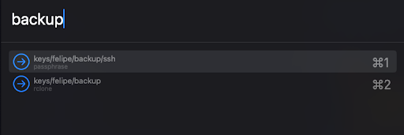

# hammerspoon

My personal Hammerspoon configurations.

```bash
.
├── README.md
├── Spoons                   # External spoons
│   └── ShiftIt.spoon
│       └── init.lua
│  
├── config
│   ├── init.lua             # config loader
│   └── keymaps.lua          # keybindings
│  
├── init.lua                 # config entry-point
├── plugins
    └── pass.lua             # Standard Unix pass plugin for fetching secrets
│  
└── utils
    ├── launchers.lua       # App launchers
```

## How to Install?

```bash
# backup previously existing settings
mv ~/.hammerspoon{,.bak}

# clone the main repo and move the configs
# to the default location
git clone https://github.com/silveiralexf/.dotfiles
mv .dotfiles/hammerspoon ~/hammerspoon

# Reload configurations from Hammerspoon UI
```

## Keybindings

All bindings are defined at [./config/keymaps.lua](./config/keymaps.lua).

Combination of keys are organized in modes for convenience, below a quick reference:

| Mode       | Shortcuts          |
| ---------- | ------------------ |
| `LEADER`   | `alt + o`          |
| `LEADER_2` | `ctrl + alt + cmd` |
| `CMD`      | `cmd` on macos     |
| `CMD_REV`  | `cmd + shift`      |

### Quick Reference

Below a quick reference of all available bindings considering the modes
from previous the section:

| Shortcut       | Description                   |
| -------------- | ----------------------------- |
| `LEADER_2 + r` | Reload configs                |
| `LEADER + j`   | Launch Google Chrome          |
| `LEADER + k`   | Launch Unix Pass Fuzzy Finder |

## Password Store Finder

For fetching credentials from [UNIX Standard Password manager](https://www.passwordstore.org/), use the keybinding referenced at the previous section (`LEADER + k`), and as long your password store is located at `$HOME/.password-store`, you should see an input as shown in the example below:



Select your credential to have it copied to clipboard.

### References & Inspirations

A big shout-out to thank the amazing folks, from which I borrowed ideas,
and code to use as starting point for my own personal setup:

- [github.com/peterlijn/hammerspoon-shiftit](https://github.com/peterklijn/hammerspoon-shiftit/)
- [github.com/4tXJ7f/hammerpass](https://github.com/4tXJ7f/hammerpass)
