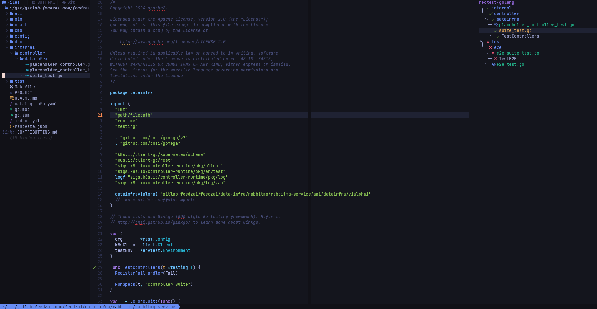

# nvim

My personal Neovim configurations.



Check the reference below on how things are organized:

```bash
# .dotfiles/nvim
.
├── init.lua                  # LazyVim entry-point
├── lua
│   ├── config
│   │   ├── autocmds.lua      # Autocmds such as file types, and LSP attachment configs
│   │   ├── keymaps.lua       # Keybindings
│   │   ├── lazy.lua
│   │   └── options.lua       # Vim global options
│   ├── lsp
│   │   ├── config.lua        # Language servers settings
│   │   │                     #
│   │   └── servers           # Customization per language server
│   │  
│   └── plugins               # Plugin customization
│   │   │                     #
│   │   ├── colorscheme.lua   # Color theme
│   │   ├── editor.lua        # Editor settings
│   │   ├── formatting.lua    # Formatting and visual options in general
│   │   │
└── spell                     # Spellchecker dictionary
```

## Disclaimer

This setup assumes the following:

- [LazyVim](https://www.lazyvim.org/) as package manager,
- [Mason](https://github.com/williamboman/mason.nvim/) and [vhyrro/luarocks.nvim](https://github.com/vhyrro/luarocks.nvim) for installing dependencies.
- [nvim-lspconfig](https://github.com/neovim/nvim-lspconfig) and [tree-sitter](https://github.com/tree-sitter/tree-sitter) for LSP configurations, code-completion, syntax-highlighting, etc.

## How to install?

```bash
# backup previously existing settings
mv ~/.config/nvim{,.bak}

# optional but recommended
mv ~/.local/share/nvim{,.bak}
mv ~/.local/state/nvim{,.bak}
mv ~/.cache/nvim{,.bak}

# clone the main repo and move nvim configs
# to its default location
git clone https://github.com/silveiralexf/.dotfiles
mv .dotfiles/nvim ~/.config/nvim

# To have all plugins installed just go into
# the directory and start nvim
cd ~/.local/nvim
nvim .
```

## Supported LSPs

All LSPs listed below are fully configured with syntax-highlighting,
auto-completion, formatting, linting and different tweaks:

- bash
- cmake
- docker
- go
- groovy
- helm
- java
- javascript
- json
- lua
- markdown
- python
- rust
- terraform
- vue
- yaml
- zig

### References & Inspirations

A big shout-out to thank the amazing folks, from which I borrowed ideas,
and code to use as starting point for my own personal setup:

- [github.com/yriveiro/nvim-files](https://github.com/yriveiro/nvim-files/tree/lazyvim)
- [hamptonmoore/nvim-glow](https://hamptonmoore.com/posts/nvim-glow/)
- [github.com/jpmcb/nvim-llama](https://github.com/jpmcb/nvim-llama)
