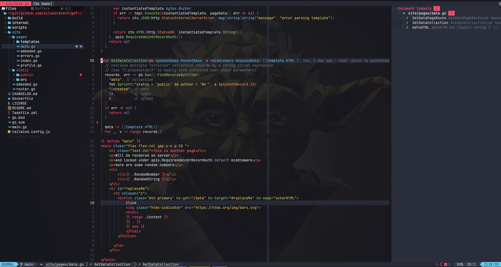

# nvim

<a href="https://dotfyle.com/silveiralexf/dotfiles-nvim"></a>
<a href="https://dotfyle.com/silveiralexf/dotfiles-nvim"></a>

My personal Neovim configurations.



Check the reference below on how things are organized:

```bash
 .
├──  init.lua               # LazyVim entry-point
├──  lazy-lock.json
├──  lazyvim.json
├── 󰂺 README.md
├──  lua
│   ├──  config
│   │   ├──  autocmds.lua    # Autocmds such as file types, LSP attach configs
│   │   ├──  keymaps.lua     # Keybindings
│   │   ├──  lazy.lua
│   │   └──  options.lua     # Neovim global options
│   │
│   ├──  lsp
│   │   ├──  config.lua      # Language server settings
│   │   └──  servers         # Customization per language server
│   │
│   ├──  plugins             # Plugin customization
│   │   ├──  colorscheme.lua # Color theme
│   │   ├──  dressing.lua    # Overall aesthetics
│   │   ├──  editor.lua      # Editor settings
│   │   ├──  formatting.lua  # Formatting and visual options in general
│   │   │
│   └──  utils               # Misc utilities
│       └──  luasnip.lua
│
└──  spell                   # Spellchecker dictionary
    ├──  en.utf-8.add
    └──  en.utf-8.add.spl
```

## Disclaimer

This setup assumes the following:

- MacOS as operating system.
- [WezTerm](../wezterm/README.md) as terminal.
- [Yazi](../yazi/README.md) for file navigation, instead of `NerdTree` or `NetRw`.
- [Tmux](../tmux/README.md) as terminal multiplexer.
- [LazyVim](https://www.lazyvim.org/) as package manager,
- [Mason](https://github.com/williamboman/mason.nvim/) and [vhyrro/luarocks.nvim](https://github.com/vhyrro/luarocks.nvim) for installing dependencies.
- [blink-cmp](https://github.com/Saghen/blink.cmp),
  [nvim-lspconfig](https://github.com/neovim/nvim-lspconfig)
  and [tree-sitter](https://github.com/tree-sitter/tree-sitter)
  for LSP configurations, code-completion, syntax-highlighting, etc.
- [Prettier](https://prettier.io/docs/configuration/) for code formatting.

## How to install?

```bash
# Generate timestamp and random string for unique backup names
timestamp=$(date '+%Y%m%d-%H%M%S')
suffix="bak-${timestamp}"

# backup previously existing settings
[ -d ~/.config/nvim ] && mv ~/.config/nvim{,."${suffix}"}

# optional but recommended
[ -d ~/.local/share/nvim ] && mv ~/.local/share/nvim{,."${suffix}"}
[ -d ~/.local/state/nvim ] && mv ~/.local/state/nvim{,."${suffix}"}
[ -d ~/.cache/nvim ] && mv ~/.cache/nvim{,."${suffix}"}

# clone the main repo and move nvim configs
# to its default location
git clone https://github.com/silveiralexf/.dotfiles
mv .dotfiles/nvim ~/.config/nvim

# To have all plugins installed just go into
# the directory and start nvim
cd ~/.local/nvim
nvim .
```

## Supported LSPs

All LSPs listed below are fully configured with syntax-highlighting,
auto-completion, formatting, linting and different tweaks:

- angularls
- bashls
- clangd
- cmake
- docker_compose_language_service
- dockerls
- eslint
- golangci_lint_ls
- gopls
- groovyls
- helm_ls
- html
- jdtls
- jsonls
- lua_ls
- marksman
- pylsp
- rust_analyzer
- taplo
- terraformls
- tflint
- tsserver
- volar
- vuels
- yamlls
- zls

### References & Inspirations

A big shout-out to thank the amazing folks, from which I borrowed ideas,
and code to use as starting point for my own personal setup:

- [github.com/yriveiro/nvim-files](https://github.com/yriveiro/nvim-files/tree/lazyvim)
- [hamptonmoore/nvim-glow](https://hamptonmoore.com/posts/nvim-glow/)
- [github.com/jpmcb/nvim-llama](https://github.com/jpmcb/nvim-llama)
