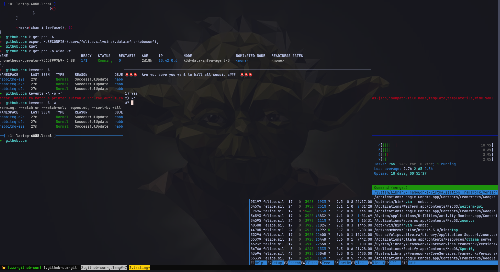
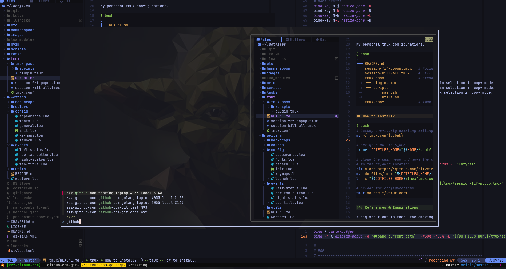

# tmux

My personal tmux configurations.



Check the reference below on how things are organized:

```bash
.
├── README.md
├── session-fzf-popup.tmux   # Fuzzy navigation between windows and sessions
├── session-kill-all.tmux    # Kill all sessions
├── tmux-pass                # Standard Unix Password plugin for fetching secrets
│   ├── plugin.tmux
│   └── scripts
│       ├── main.sh
│       └── utils.sh
└── tmux.conf                # Tmux configs
```

## How to Install?

```bash
# backup previously existing settings
mv ~/.tmux.conf{,.bak}

# set your DOTFILES_HOME
export DOTFILES_HOME="${HOME}/.dotfiles"

# clone the main repo and move the configs
# to the default location
git clone https://github.com/silveiralexf/.dotfiles
mv .dotfiles/tmux "${DOTFILES_HOME}/tmux"
ln -s "${DOTFILES_HOME}/tmux/tmux.conf" ~/tmux.conf

# reload the configurations
tmux source ~/.tmux.conf
```

## Keybindings

Tmux Leader key is set by default as `cmd + a` -- check the complete list
of bindings at `tmux.conf` file itself and customize per your personal
preferences.

For fuzzy session navigation, make sure you have [fzf](https://github.com/junegunn/fzf/) installed and accessible
from your `PATH`, and press `leader+w` for navigation, as shown below:



## References & Inspirations

A big shout-out to thank the amazing folks, from which I borrowed ideas,
and code to use as starting point for my own personal setup:

- [github.com/rafi/tmux-pass](https://github.com/rafi/tmux-pass)
