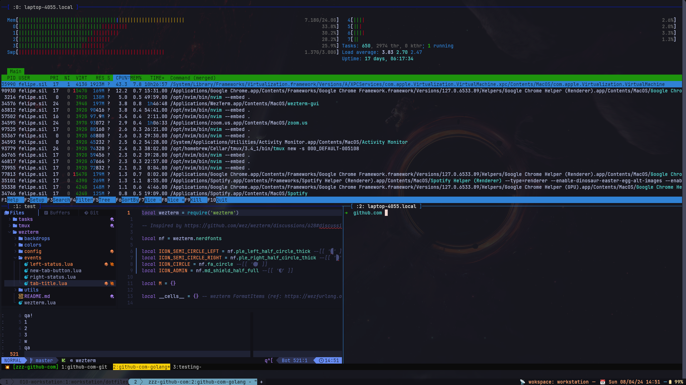

# wezterm

My personal WezTerm configurations.



Check the reference below on how things are organized:

```bash
# .dotfiles/wezterm
.
├── README.md
├── backdrops             # Background images
├── colors
│   └── custom.lua        # Color scheme (custom catppucchin mocha)
├── config
│   ├── appearance.lua    # Options for look and feel, tab and window settings
│   ├── keymaps.lua       # Key-bindings and leader key settings
│   ├── fonts.lua         # Default font, size and options
│   ├── general.lua       # General global settings
│   ├── init.lua          # Configuration entry-point
│   └── launch.lua        # Config option loader
|
├── events                # Event handlers for bars, panes and tab status
│   ├── left-status.lua
│   ├── new-tab-button.lua
│   ├── right-status.lua
│   └── tab-title.lua
├── utils                 # Common helpers and utilities
│   ├── backdrops.lua
│   ├── gpu_adapter.lua
│   ├── math.lua
│   └── platform.lua
└── wezterm.lua           # Entry-point
```

## Disclaimer

This setup assumes one is using `Tmux` or something equivalent for handling
navigation of panes, windows and etc, instead of relying on WezTerm itself.

Mostly because I really like `Tmux` and never felt the need to replace it.

You may follow the example from the extract below for setting up equivalent
configurations using WezTerm alone:

```lua
-- ./config/bindings.lua
{ mods = mod.CMD, key = 'LeftArrow', action = act.ActivatePaneDirection 'Prev' },
{ mods = mod.CMD, key = 'RightArrow', action = act.ActivatePaneDirection 'Next' },
{ mods = mod.CMD, key = 'UpArrow', action = act.ActivatePaneDirection 'Up' },
{ mods = mod.CMD, key = 'DownArrow', action = act.ActivatePaneDirection 'Down' },
```

More examples from the official documentation:

- [WezTerm/ActivatePaneDirection](https://wezfurlong.org/wezterm/config/lua/keyassignment/ActivatePaneDirection.html?h=activate+pane+direc)
- [WezTerm/RotatePanes](https://wezfurlong.org/wezterm/config/lua/keyassignment/RotatePanes.html?h=pane)

## How to install?

Assuming Wezterm is already installed, as further detailed at the [official docs](https://wezfurlong.org/wezterm/installation.html), just perform the following steps to install:

```bash
# backup any existing configurations
mv ~/.config/wezterm{,.bak}

# optional but recommended
mv ~/.local/share/wezterm{,.bak}
mv ~/.local/state/wezterm{,.bak}
mv ~/.cache/wezterm{,.bak}

# clone the main repo and move wezterm configs
# to default location
git clone https://github.com/silveiralexf/.dotfiles
mv .dotfiles/wezterm ~/.config/wezterm

# Background images are expected to be ~/.wezterm/backdrops
# you may create a link or move the samples as per below
mv .dotfiles/images/backdrops ~/.config/wezterm/backdrops
```

## Keybindings

### Modes

All bindings are defined at [./config/keymaps.lua](./config/keymaps.lua).

Combination of keys are organized in modes for convenience, below a quick reference:

| Mode       | Shortcuts                           |
| ---------- | ----------------------------------- |
| `LEADER`   | `alt + a`                           |
| `CMD`      | `cmd` on macos and `super` on Linux |
| `CMD_REV`  | `cmd + shift`                       |
| `CTRL`     | `ctrl`                              |
| `CTRL_REV` | `ctrl+shift`                        |

### Quick Reference

Below a quick reference of all available bindings considering the modes
from previous the section:

| Shortcut               | Description                                                                                    |
| ---------------------- | ---------------------------------------------------------------------------------------------- |
| `F1`                   | Active Command Palette                                                                         |
| `F2`                   | Workspace finder                                                                               |
| `F3`                   | Workspace launcher with Input                                                                  |
| `F4`                   | Show Launcher                                                                                  |
| `F5`                   | Activate Copy & Paste Mode                                                                     |
| `F11`                  | Full screen                                                                                    |
| `F12`                  | Debugger                                                                                       |
| `CMD + c`              | Copy                                                                                           |
| `CMD + v`              | Paste                                                                                          |
| `CMD + k`              | Reset scrollback                                                                               |
| `CMD + f`              | Find text on screen                                                                            |
| `CMD + n`              | New window                                                                                     |
| `CMD + t`              | New tab                                                                                        |
| `CMD + w`              | Close tab                                                                                      |
| `CMD + r`              | Rename tab                                                                                     |
| `CMD + u`              | URL launcher                                                                                   |
| `CMD + ,`              | Swap background image left                                                                     |
| `CMD + .`              | Swap background image right                                                                    |
| `CMD + LeftArrow`      | Focus Tab Left                                                                                 |
| `CMD + RightArrow`     | Focus Tab Right                                                                                |
| `CMD_REV + LeftArrow`  | Swap Tab Left                                                                                  |
| `CMD_REV + RightArrow` | Swap Tab Right                                                                                 |
| `CMD + +`              | Increase font size                                                                             |
| `CMD + n`              | Decrease font size                                                                             |
| `LEADER + f`           | Resize Font interactively (`k` to increase, `j` decrease, `r` reset, `Escape` / `q` to cancel) |

### References & Inspirations

A big shout-out to thank the amazing folks, from which I borrowed ideas,
and code to use as starting point for my own personal setup:

- [github.com/KevinSilvester/westerm-config](https://github.com/KevinSilvester/wezterm-config/)
