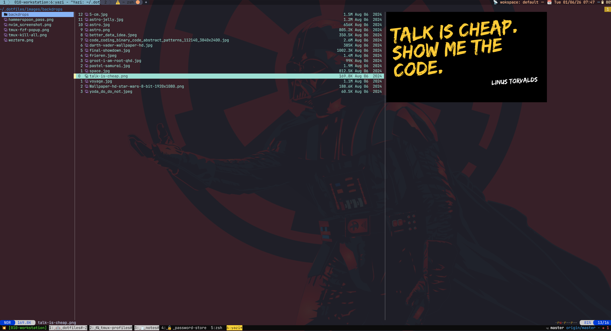

# yazi

My personal yazi configurations.



Check the reference below on how things are organized:

```bash
.
├── flavors                      # themes & color scheme
│   └── catppuccin-mocha.yazi
│       ├── flavor.toml
│       └── tmtheme.xml
├── plugins                      # Third-party modules
│  
├── init.lua                     # custom config entry-point
│  
├── keymap.toml                  # Keybindings
│  
├── theme.toml                   # theme flavor settings
│  
└── yazi.toml                    # main config settings
```

## How to Install?

For official install instructions, check the following:

- [Yazi Docs: Installation](https://yazi-rs.github.io/docs/installation/)

## Keybindings

```bash
# Generate timestamp and random string for unique backup names
timestamp=$(date '+%Y%m%d-%H%M%S')
suffix="bak-${timestamp}"

# backup previously existing settings
[ -d ~/.config/yazi ] && mv ~/.config/yazi{,."${suffix}"}

# clone the main repo and move nvim configs
# to its default location
git clone https://github.com/silveiralexf/.dotfiles
mv .dotfiles/yazi ~/.config/yazi
```

## Plugins

| Name                                                                             | Description                                                      |
| -------------------------------------------------------------------------------- | ---------------------------------------------------------------- |
| [yazi-rs/plugins:git](https://github.com/yazi-rs/plugins/tree/main/git.yazi)     | Show the status of Git file changes as linemode in the file list |
| [hankertrix/augment-command](https://github.com/hankertrix/augment-command.yazi) | A plugin to augment some Yazi commands.                          |
| [dedukun/relative-motions](https://github.com/dedukun/relative-motions.yazi)     | A Yazi plugin based about vim motions.                           |
